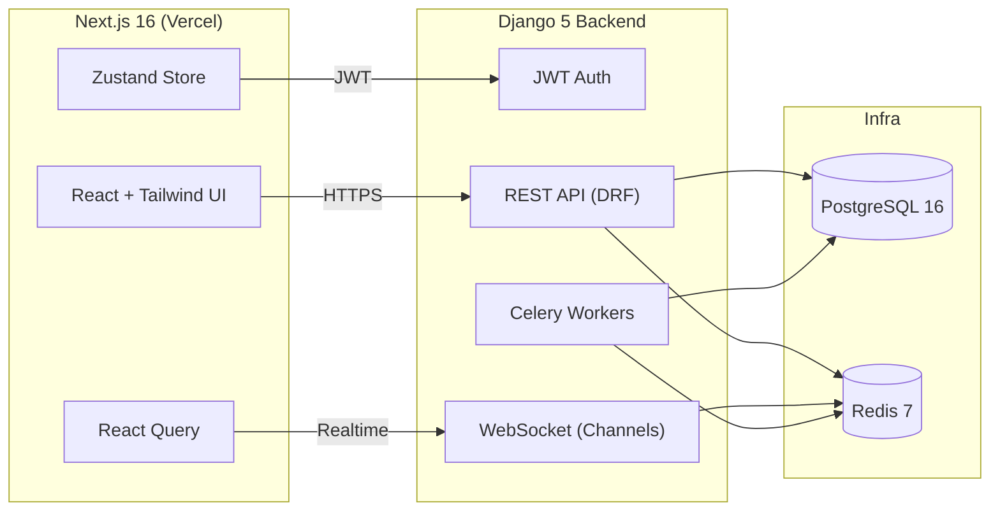

<div align="center">
  <h1>RelayDesk</h1>
  <p>Real-time customer support &amp; chat management platform.</p>
  <p>
    <a href="https://github.com/KAPSULA1/relaydesk/actions/workflows/backend.yml"></a>
    <a href="https://github.com/KAPSULA1/relaydesk/actions/workflows/frontend.yml"></a>
    <a href="#testing"></a>
    <a href="#deployment"></a>
  </p>

  <h3>🚀 Live Demos</h3>
  <p>
    <a href="https://relaydesk-on95.vercel.app"></a>
    <a href="https://relaydesk-backend.onrender.com/api/health/"></a>
  </p>
  <p>
    <strong>Test Accounts:</strong> user1, user2, user3... user10 | <strong>Password:</strong> demo123
  </p>
</div>

> RelayDesk unifies live chat, escalations, and customer context in one console. Django Channels + Redis power WebSocket conversations, while Next.js 16 delivers a Lightning-fast dashboard. DevOps enjoy Docker, Makefile tasks, and CI/CD pipelines that deploy seamlessly to Render (backend) and Vercel (frontend).  
> **Tags:** django, nextjs, websocket, redis, celery, realtime, docker, saas, support, analytics

---

## 🧱 Architecture



---

## ✨ Features
- 🔐 **JWT Auth:** SimpleJWT with refresh tokens, CSRF/CORS hardened.
- ⚡ **Realtime chat:** Django Channels + Redis for typing indicators, presence, and message delivery.
- 📚 **Support workflows:** Room roles, SLA timers, transcript exports, and search.
- 🧰 **Dev tooling:** Makefile orchestration, Docker Compose, Render + Vercel configs.
- ✅ **Quality gate:** pytest + coverage plus pnpm test with coverage, enforced in CI.

---

## 🧰 Tech Stack

| Layer | Technologies |
| --- | --- |
| **Backend** | Django 5, DRF, Channels, Celery, SimpleJWT, pytest |
| **Frontend** | Next.js 16, TypeScript, Tailwind CSS, React Query, Zustand, pnpm |
| **Data / Infra** | PostgreSQL 16, Redis 7, Docker, Render, Vercel |
| **Tooling** | GitHub Actions, pytest-cov, pnpm, Makefile, docker-compose |

---

## 🚀 Quick Start

### 1. Local Backend
```bash
cp backend/.env.example backend/.env
python -m venv backend/venv
source backend/venv/bin/activate
pip install --upgrade pip
pip install -r backend/requirements.txt
python backend/manage.py migrate
python backend/manage.py runserver 0.0.0.0:8010
```

### 2. Local Frontend
```bash
cp frontend/.env.example frontend/.env.local
cd frontend
pnpm install
pnpm dev --port 3100
```

### 3. Docker Compose
```bash
docker compose up -d --build
# docker compose down
```

### 4. Makefile Highlights
```bash
make be-install   # backend deps + venv
make be-run       # Django dev server
make fe-install   # pnpm install
make fe-dev       # Next.js dev server
make up           # docker compose
make be-test      # pytest + coverage
make fe-test      # pnpm test --coverage
```

---

## 🧪 Testing

| Layer | Command |
| --- | --- |
| Backend | `pytest --cov=chat --cov=relaydesk --cov-report=term-missing` |
| Frontend | `pnpm test -- --coverage --runInBand` |

Coverage artifacts are uploaded by CI and surfaced via the badge above.

---

## 📦 Deployment

### Backend (Render)
- Configured via `render.yaml`.
- Build: `pip install -r backend/requirements.txt && python manage.py collectstatic --noinput`.
- Start: `gunicorn relaydesk.wsgi:application --bind 0.0.0.0:8010`.
- Health check: `/api/health/`.
- Managed Postgres + Redis services linked through env vars.

### Frontend (Vercel)
- Driven by `vercel.json`.
- Build: `pnpm install && pnpm build`.
- Run: `pnpm start` (served by Vercel’s Next.js runtime).
- Rewrites `/api/*` to the Render backend.

---

## 🔧 Environment Variables

| Variable | Scope | Description |
| --- | --- | --- |
| `DJANGO_SETTINGS_MODULE` | Backend | e.g. `relaydesk.settings.prod` |
| `DJANGO_SECRET_KEY` | Backend | Secret key for Django |
| `DATABASE_URL` | Backend | Postgres connection string |
| `REDIS_URL` | Backend | Redis cache / broker |
| `ALLOWED_HOSTS` | Backend | Public hosts for Django |
| `CORS_ALLOWED_ORIGINS` | Backend | Allowed origins for SPA |
| `NEXT_PUBLIC_API_URL` | Frontend | e.g. `https://relaydesk-backend.onrender.com` |
| `NEXT_PUBLIC_APP_NAME` | Frontend | Branding string |
| `NEXT_PUBLIC_ENV` | Frontend | `development` / `production` |

---

## 🧰 CI/CD

| Workflow | Description |
| --- | --- |
| `.github/workflows/backend.yml` | 🐍 Spins up Postgres + Redis, installs deps, runs pytest w/coverage, uploads artifact, triggers Render deploy hook. |
| `.github/workflows/frontend.yml` | ⚛️ Installs pnpm deps, lints, runs coverage tests, builds Next.js, triggers Vercel deploy hook. |

---

## 🛠 Troubleshooting

| Issue | Fix |
| --- | --- |
| **Postgres errors** | Ensure `DATABASE_URL` matches running service or Compose stack. |
| **Redis not reachable** | Verify Redis container or managed instance is available and URL is correct. |
| **JWT auth failures** | Confirm clocks are in sync and `NEXT_PUBLIC_API_URL` matches backend domain. |
| **Port conflicts** | Override via `.env` (backend) or `pnpm dev --port`. |
| **WebSocket drops** | Check Redis connection + `REDIS_URL`, ensure SSL termination forwards `Upgrade` headers. |

---

## 🔐 Security & Maintenance
- Dependabot monitors Python and Node dependencies.
- CodeQL (optional) can be added to GitHub Actions for static analysis.
- Health endpoints expose minimal metadata, secrets live solely in env vars or secret stores.

---

## 📝 License & Contact

Licensed under the [MIT License](LICENSE).  
Questions or collaboration ideas? Email **support@relaydesk.app**.

---

## ✅ Final Checklist

| Artifact | Status |
| --- | --- |
| Makefile | ✅ |
| Dockerfiles (backend, frontend) | ✅ |
| docker-compose.yml | ✅ |
| GitHub Actions (backend.yml, frontend.yml) | ✅ |
| render.yaml & vercel.json | ✅ |
| README (you are here) | ✅ |
| pytest + pnpm test coverage | ✅ |
